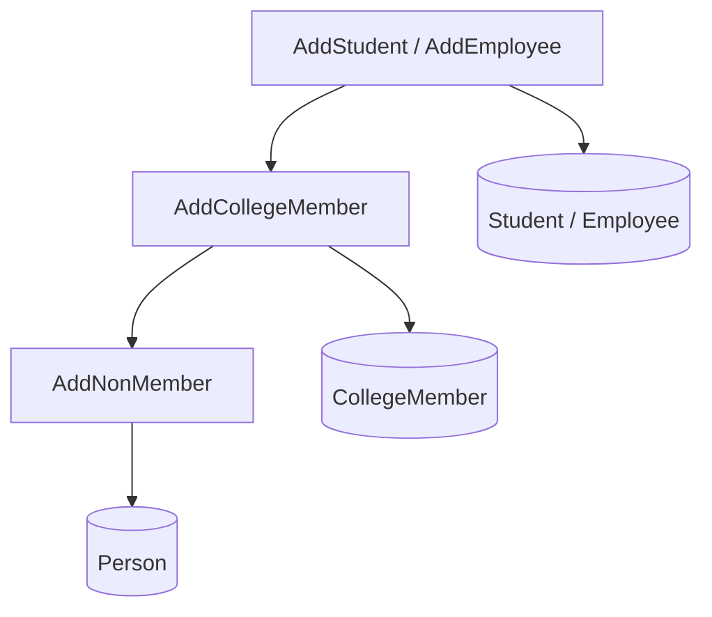
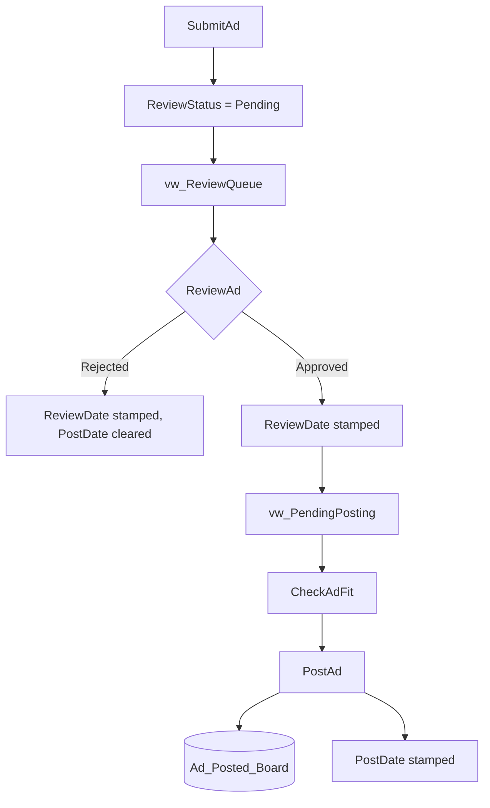
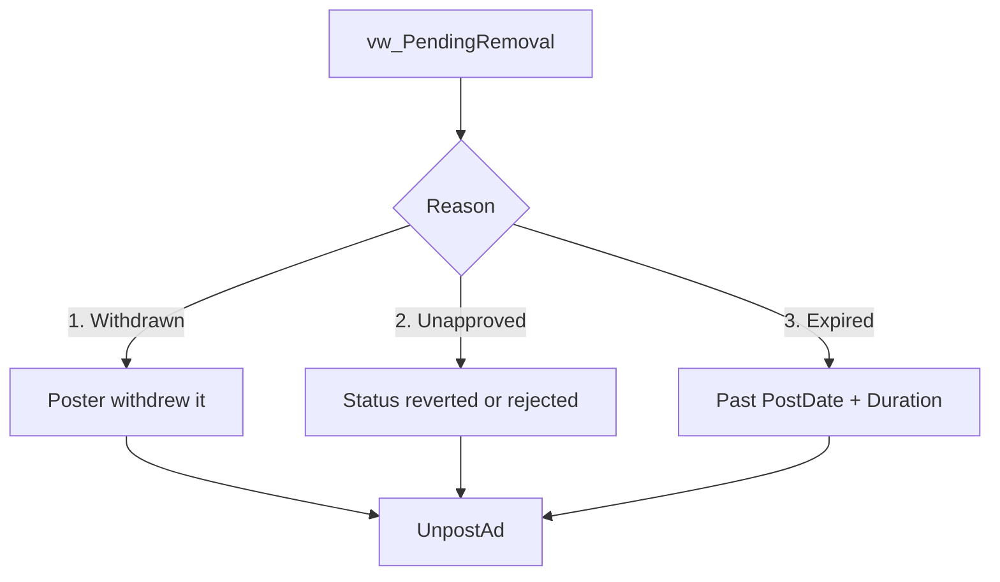
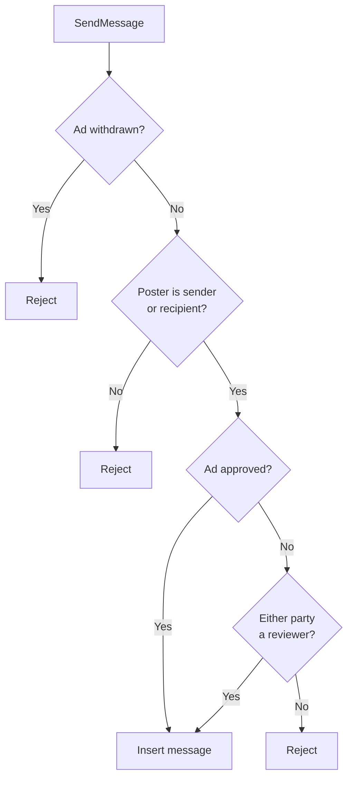

# Designing a Campus Ad-Posting Database for SQL Server and MySQL

This project models a relational database that manages advertisement postings across physical boards on a college campus, with a review workflow, size-capacity accounting, and a messaging system between posters and interested parties. The deliverable is a complete schema implemented twice, once in MS SQL Server (T-SQL) and once in MySQL, together with a full layer of views and stored procedures covering the ad lifecycle from submission through review, posting, expiry, and removal.

The project originated as the final project of a database systems course in my Data Analytics diploma at Douglas College. The modeling, both implementations, and all queries are my own work.

The full DDL, seed data, and query scripts for both platforms are available in the repository: [**GitHub repo**](https://github.com/mikeverwer/AdPostingDatabase)


## The Domain

The system serves a single college campus on which physical bulletin boards are the primary medium for peer-to-peer advertising. Boards are mounted throughout the campus buildings, and the database exists to manage what goes on them, who authorized it, how long it stays, and how an interested reader gets in touch with whoever put it there.

A key fact about this system is that the ads and boards are physical objects. An ad has a printed length and width in centimetres, and a board has a finite length and width of its own, so the database has to account for space. Additionaly, it needs to accommodate the fact that it takes real time for physical actions to occur. For example, after an ad gets approved, someone needs to actually go to a board and put the ad up. Ads also have a requested duration, after which its occupancy of that space is no longer authorized, but again someone needs to then go and remove it. Therefore, the database needs to hold the state of an ad in multiple dimensions: approval in the system and physical presence. A purely digital system could simply include or remove an ad from its catalogue based solely on its approval status.

Three populations of people can submit ads. Students and employees are both members of the college and are identified internally by a college ID; registered non-members are people with no college affiliation who have nonetheless been entered into the system, such as alumni or local residents advertising a room for rent. All three submit ads on the same terms, and the distinction matters for reporting rather than for permission. An ad falls into one of seven categories: tutoring offers, rentals, items for sale, roommate searches, event listings, services, and a general "other" bucket.

Before an ad reaches any board it must be approved. Review authority is a permission granted to individual employees rather than a job title, so a given employee either holds it or does not, and only those who do can render a decision. A reviewer cannot approve their own ad. Review is a decision on the ad itself rather than on a particular placement, so one approval authorizes every location the ad subsequently goes up in. A decision is not final in the sense of being irreversible: an approved ad can be sent back to pending or rejected outright if it turns out to be a problem, which is why the system has to be able to identify ads that are physically on a board but no longer authorized to be there.

As mentioned above, approval and posting are separate events. An ad can be approved and never posted, which is the normal state of the backlog between a reviewer's decision and someone walking the ad over to a board. A poster can also withdraw an ad at any point, whether it has been reviewed or not, and withdrawal is the poster's own action rather than an administrative one. The physical world does not update itself when a database row changes, so at any moment the logical state of an ad and its physical presence on a board can disagree in both directions, and reconciling the two is one of the system's standing jobs.

Finally, people can message the poster of an ad. Messages are stored against the ad they concern rather than as a standalone inbox, so a conversation is always about something specific, and the poster is necessarily one of the two parties. This is the channel through which a reviewer asks a poster to change something before approving, and through which a reader asks whether the bike in the photograph is still available.

An interesting decision came from the way people are modeled in the system. A faculty member is a person who is a college member who is an employee who is faculty. That is a four-level specialization hierarchy, and how you represent it determines how pleasant the rest of the database is to work with.

## Modeling the Person Hierarchy

There are two standard ways to put a specialization hierarchy into tables.

The first is a single `Person` table carrying every attribute any kind of person might have, with NULLs for whatever does not apply. A non-member would have NULL for college ID, department, major, office location, and position title. This is trivial to implement and miserable to use: the table is mostly NULL, nothing about the schema tells you which combinations of attributes are coherent, and every query over a specific kind of person has to reconstruct the type from NULL patterns.

The second is a supertype/subtype decomposition: a `Person` supertype, a `CollegeMember` subtype, and `Student` and `Employee` subtypes below that, each connected by an IS-A relationship sharing `PersonID` as the key. Membership in a table is the type assertion. Each table carries only the attributes that actually apply, and the schema itself documents the domain.

I used the subtype approach, with one deliberate simplification at the bottom of the tree. Employees fall into five categories, Faculty, Administration, Staff, Support, and Specialized, and none of them carry any attribute, behavior, or constraint the others do not already share through `Employee` itself. Rather than model five near-identical subtype tables, I represented the distinction with a single CHECK-constrained `PositionTitle` column: selecting all faculty is a one-predicate query, and the schema stays four tables instead of potentially nine. Similarly, non-members have no attributes a bare `Person` lacks, so they exist simply as the `Person` entity with no further specialization.

The subtype tables are also not disjoint. A person may hold both Student and Employee status simultaneously, which is the ordinary case of a graduate student working as a teaching assistant, and neither `GrantStudentRole` nor `GrantEmployeeRole` checks for the other. Only `RevokeCollegeMemberRole` enforces an ordering, refusing to delete the `CollegeMember` row while either subtype row still references it.


## The Relational Schema

Mapping the EER model gives eight relations:

- <code>Person(<u>PersonID</u>, FirstName, LastName, Phone, Email)</code>
- <code>CollegeMember(<u>**PersonID**</u>, CollegeID, Department)</code>
- <code>Student(<u>**PersonID**</u>, Major)</code>
- <code>Employee(<u>**PersonID**</u>, OfficeLocation, Extension, PositionTitle, IsReviewer)</code>
- <code>Ad(<u>AdID</u>, **PosterID**, **ReviewerID**, Title, AdType, AdLength, AdWidth, Duration, PostDate, ReviewStatus, EnteredPending, ReviewDate, IsWithdrawn, WithdrawnDate, ImageFileName)</code>
- <code>Board(<u>Building, BldgFloor, Slot</u>, BoardLength, BoardWidth)</code>
- <code>Ad_Posted_Board(<u>**AdID**, **Building**, **BldgFloor**, **Slot**</u>)</code>
- <code>Messages(<u>**SenderID**, **AdID**, TimeLogged</u>, **RecipientID**, Content)</code>

> *Underlined: primary key (a single underline spans every column of a composite key). Bold: foreign key. A column that is both, a specialization key inherited from a supertype or a component of a junction table's key, carries both marks.*

A few of the key choices. `Board` uses the natural composite key (building, floor, slot) rather than a surrogate `BoardID`; the composite is short, stable, and human-readable, which matters for a table people will reference when physically walking to a board. The third component, `Slot`, is a single letter distinguishing multiple boards on the same floor (a floor with two boards has slots `A` and `B`), not a description of physical position. `Ad_Posted_Board` resolves the many-to-many relationship between approved ads and boards, since one ad may be posted in several locations. `Messages` uses (SenderID, AdID, TimeLogged) as its key, with the timestamp at the highest available precision so that the composite stays unique in practice. Reviewer status is an `IsReviewer` flag on `Employee` rather than a separate entity, and in the schema the `Ad.ReviewerID` foreign key targets `Employee` directly, so "only employees review ads" is enforced structurally rather than by procedure logic alone.

Using the physical location as `Board`'s primary key is the one choice here I would call a genuine tradeoff rather than a clean win. It is a mutable natural key doing a primary key's job, and relocating a board is therefore a primary key update. That is made survivable by declaring the foreign key from `Ad_Posted_Board` with `ON UPDATE CASCADE`, so `EditBoardDetails` can relocate a board in a single statement and the postings follow automatically. A surrogate `BoardID` would remove the mutability problem entirely, but it touches seven other objects in the schema and query layer, and the problem it would solve has not actually materialized, so it has not been introduced.

## Normalization

Each relation in the mapping is normalized up to BCNF, with one deliberate exception outlined below. As the following analysis shows, several of the relations are trivially normalized, but there are others with subtle dependencies that could easily be overlooked. It is also worth noting that the schema itself is fully in line with all assumptions made regarding candidate keys.

Person
: `PersonID` is the primary key, and `Email` is a second candidate key, since it is both `UNIQUE` and `NOT NULL` in the schema, not merely assumed to be one-per-person. Although in reality phone numbers are often unique, and it is reasonable to assume that all people have a phone number, `Phone` does not qualify since it is nullable in this design, and a nullable column can never be a candidate key. Additionally, employees may share the same base phone number but have a different extension. Therefore, this schema does not enforce uniqueness for `Phone`. Email is used as the primary mode of communication in the system and users can optionally provide a phone number, therefore `Phone` is better described as an ordinary attribute functionally dependent on `PersonID`, the same as `FirstName` or `LastName`, not a determinant of anything itself. With `PersonID` and `Email` as the relation's only two candidate keys, every determinant in `Person` is a superkey, and BCNF holds without leaning on an assumption the schema does not actually enforce.

CollegeMember, Student, Employee
: Each subtype table is keyed on the inherited `PersonID`, and `CollegeID` is a second candidate key of `CollegeMember` (`UNIQUE`, `NOT NULL`). None of the remaining attributes in `Student` determine each other. `Employee`, however, has an interesting subtlety.
: Some employees share an office, which raises the question of whether `OfficeLocation` determines `Extension`, since a shared desk phone would mean every employee at that location shares the same extension too. This would be a non-key attribute determining another non-key attribute, and therefore a BCNF violation (in fact, also a 3NF violation since `Extension` is not part of any candidate key). I considered decomposing this into a separate `Office(OfficeLocation, Extension)` relation, with `Employee.OfficeLocation` becoming a foreign key into it. I chose not to since no query in this system currently needs to ask "who else shares this extension" independent of a specific employee, and a formal `Office` entity for a system this size felt like decomposing for the sake of the exercise rather than for anything the schema needs to do. The `chk_employee_extension_requires_office` constraint (`Extension IS NULL OR OfficeLocation IS NOT NULL`) already captures the part of that relationship that matters operationally, that an extension cannot exist without a desk to attach it to, without requiring another table to say so.

Ad
: `AdID` is the only candidate key. The tempting hidden dependency here is between `ReviewStatus` and the several date columns, since `PostDate` and `ReviewDate` are both populated as a consequence of the review outcome. Neither is a functional dependency. Two different approved ads have two different post dates, so `ReviewStatus` does not determine either value. What actually exists is a correlation between `ReviewStatus` and those columns' *nullability*: `ReviewDate` is non-null exactly when the ad is not Pending, and `PostDate` is non-null only when the ad is Approved. BCNF has no vocabulary for this, since it governs value-determines-value dependencies and says nothing about nullability. That correlation still needs enforcing, and it is enforced by CHECK constraints rather than left to procedure logic, as described in the next section. The same reasoning applies to `WithdrawnDate` against `IsWithdrawn`.

Board and Ad_Posted_Board
: `Board`'s only non-key attributes are `BoardLength` and `BoardWidth`, and nothing about a building or floor determines a board's dimensions, since different boards in the same building can plausibly be different sizes, so there is no dependency to find. `Ad_Posted_Board` has no non-key attributes at all: it is a pure junction table whose composite key is the entire relation, which makes it trivially in BCNF, since there is nothing left for a dependency to violate.

Messages
: The plausible violation to check for is whether `(SenderID, AdID)` alone determines `RecipientID`, which would make the full three-column key unnecessarily wide. However, if the poster of an ad responds to two different interested parties about the same ad, the same sender and ad pair would appear against two different recipients, so the dependency does not hold and the full key is genuinely necessary.

Across all eight relations, `Board`, `Ad_Posted_Board`, and `Messages` are the three composite-key tables in the schema; the rest are keyed on a single inherited or generated ID. Each is in BCNF and enforced by the schema, except in the case of `Employee`, which is deliberately not decomposed.

## Schema Integrity

The business rules live in the DDL wherever the engine allows it. Enumerated domains are closed by CHECK constraints: `AdType` is restricted to seven values, `ReviewStatus` to Pending, Approved, and Rejected, and `PositionTitle` to the five employee categories. Ad and board dimensions must be positive, as must a requested duration. Emails and college IDs are unique. The self-review prohibition is a one-line CHECK:

```sql
CONSTRAINT chk_ad_poster_reviewer CHECK (PosterID <> ReviewerID)
```

The more interesting constraints are the ones tying a nullable date to the state that justifies it. Where the intended rule is a biconditional, a single CHECK enforces only half of it, so the constraints are written in pairs. `ReviewDate` is the clean case:

```sql
CONSTRAINT chk_ad_reviewdate_requires_nonpending
   CHECK (ReviewDate IS NULL OR ReviewStatus <> 'Pending'),

CONSTRAINT chk_ad_nonpending_requires_reviewdate
   CHECK (ReviewStatus = 'Pending' OR ReviewDate IS NOT NULL)
```

Together these say that a review date exists exactly when the ad is no longer pending. Neither constraint alone would do it: the first permits an Approved ad with no review date, and the second permits a Pending ad carrying one. `WithdrawnDate` and `IsWithdrawn` are constrained the same way, so a withdrawal flag without a date, or a date without the flag, are both unrepresentable.

`PostDate` is the deliberate asymmetry. Only the first half of the pair is present:

```sql
CONSTRAINT chk_ad_postdate_requires_approval
   CHECK (PostDate IS NULL OR ReviewStatus = 'Approved')
```

An ad cannot carry a post date unless it is approved, but an approved ad is not required to carry one, because approval is permission to post rather than the act of posting. An ad can sit approved and unposted indefinitely, and that population is exactly what `vw_PendingPosting` reports.

The NULL policy elsewhere is decided per column with a stated reason rather than by default. `ReviewerID` is NULL until a review happens, and returns to NULL if the reviewer's employee record is later revoked. `Student.Major` permits NULL because a student may not have declared one. `Employee.OfficeLocation` permits NULL, and is not unique, because some employees have no office and some share one. `Employee.Extension` follows the same reasoning one step further: it is nullable, but a CHECK ties it to `OfficeLocation`, so an employee cannot be given a phone extension without a desk to answer it at. `PositionTitle`, by contrast, is `NOT NULL`, because it functions as the discriminator between employee categories, and an employee record with no position title would be an uncategorized employee, which the schema should not allow.

Delete behavior is also a business rule, and the schema applies two different policies deliberately. `Ad_Posted_Board` cascades from both parents, since a posting record has no meaning once either the ad or the board is gone, and its board-side foreign key additionally cascades on update so that relocating a board carries its postings with it. `Messages.AdID`, by contrast, restricts: an ad's life on the boards is often shorter than the conversation it starts, so deleting an ad while a poster and an interested party are still messaging about it would destroy that history. Restricting the delete forces that decision to be made deliberately, which is why `DeleteAd` and `WithdrawAd` both call `DeleteAdMessages` explicitly rather than relying on a cascade to do it quietly.

Finally, a note on what the schema does not enforce. `chk_ad_poster_reviewer` prevents a reviewer from being recorded as the reviewer of their own ad, but it does not prevent that same person from calling `DeleteAd` on their own ad, since `DeleteAd` authorizes on the `IsReviewer` flag rather than on the ad's recorded reviewer. That conflict-of-interest edge case is currently unresolved.

## Dual Implementation

Implementing the same schema on both SQL Server and MySQL turned up more friction than I expected, and documenting that friction became part of the project. The two implementations are kept behaviorally equivalent wherever the engines allow it, and every place they cannot be is documented inline in the scripts.

The routine differences are catalogued there: `IDENTITY` versus `AUTO_INCREMENT`, `GO` batch separators, `DELIMITER` blocks and parameter syntax for stored procedures, `RAISERROR` versus `SIGNAL SQLSTATE '45000'`, `GETDATE()` returning a DATETIME where MySQL's `CURRENT_DATE()` returns a DATE, two incompatible signatures for `DATEDIFF`, and the absence of `ROLLUP` in the same syntactic position. Explicit row locking differs as well: the SQL Server procedures use table hints (`WITH (UPDLOCK, HOLDLOCK)`) where the MySQL procedures use `SELECT ... FOR UPDATE`, which lands in the same place semantically but reads nothing alike.

A more subtle difference shows up in indexing rather than syntax. MySQL automatically indexes every foreign key column when the constraint is created but SQL Server does not. The MSSQL script therefore adds five explicit indexes, one for every foreign key column not already covered by a primary key. The composite foreign key is the easy case to miss: `Ad_Posted_Board`'s primary key is `(AdID, Building, BldgFloor, Slot)`, so `AdID` alone is already indexed, but the three board columns are trailing components of that key and get no benefit from it, since a composite index only serves lookups that use its columns as a left-to-right prefix.

Two differences forced actual divergence rather than translation. The first is error propagation, and it is subtle enough that it changed the shape of the procedure code. MySQL's `SIGNAL` raises an exception that aborts the entire call stack, so a validation failure deep inside a nested procedure terminates the outer procedure as well. SQL Server's `RAISERROR` followed by `RETURN` exits only the procedure that raised it; control returns to the caller, which carries on as though nothing had happened. The registration procedures are layered, with `AddStudent` calling `AddCollegeMember` calling `AddNonMember`, so on SQL Server a duplicate email caught in the innermost call would otherwise let the outer procedures continue and attempt to insert subtype rows against a NULL identity. The MSSQL implementation compensates with an explicit guard after each nested call:

```sql
EXEC AddCollegeMember ..., @_PersonID = @_PersonID OUTPUT;
IF @_PersonID IS NULL RETURN;
```

The output parameter doubles as the success signal. With those guards in place the observable behavior of the two implementations matches, which is the standard the project holds itself to.

The second is the one that required real engineering. `Messages` holds two foreign keys into `Person`, one for the sender and one for the recipient. SQL Server refuses to attach cascading delete actions to foreign keys when doing so would create multiple cascade paths into the same table, which is exactly this situation. Only one of the two keys may cascade; the other blocks deletion. Since nearly every sender is also a recipient somewhere, the practical consequence is that no person could ever be deleted from the database. `Ad.ReviewerID` compounds the problem indirectly rather than directly: it references `Employee`, not `Person`, but `Employee.PersonID` is itself the same value as `Person.PersonID` further down the specialization hierarchy, so deleting a person who happens to be an employee still requires clearing any ad that lists them as reviewer before the deletion can proceed.

MySQL has no such restriction, so the MySQL implementation uses ordinary `ON DELETE CASCADE` clauses and the problem never arises. On SQL Server I resolved it with an `INSTEAD OF DELETE` trigger on `Person` that scripts the cascade manually, deleting dependents in dependency order and detaching reviewer references before removing the person:

```sql
CREATE TRIGGER trg_DeletePersonCascade
ON Person
INSTEAD OF DELETE
AS
BEGIN
    DELETE Ad_Posted_Board
    FROM Ad_Posted_Board apb
    JOIN Ad a ON apb.AdID = a.AdID
    WHERE a.PosterID IN (SELECT PersonID FROM deleted);

    DELETE FROM Ad
    WHERE PosterID IN (SELECT PersonID FROM deleted);

    UPDATE Ad
    SET ReviewerID = NULL
    WHERE ReviewerID IN (SELECT PersonID FROM deleted)
      AND PosterID NOT IN (SELECT PersonID FROM deleted);

    DELETE FROM Messages
    WHERE SenderID IN (SELECT PersonID FROM deleted)
       OR RecipientID IN (SELECT PersonID FROM deleted);

    DELETE FROM Student       WHERE PersonID IN (SELECT PersonID FROM deleted);
    DELETE FROM Employee      WHERE PersonID IN (SELECT PersonID FROM deleted);
    DELETE FROM CollegeMember WHERE PersonID IN (SELECT PersonID FROM deleted);
    DELETE FROM Person        WHERE PersonID IN (SELECT PersonID FROM deleted);
END
```

The ordering inside the trigger is the whole content of it. Postings are removed before the ads they reference, the reviewer detachment is deliberately restricted to ads that are not themselves being deleted, messages are cleared before their `Person` rows disappear, and the subtype tables unwind from the leaves of the hierarchy back to the root.

## Design Rationale

Before discussing the queries and workflows, it is worth stating the principles the design adheres to, because most of the individual choices later in this article are consequences of one of them.

**History is preserved; live state is the exception.** Most date and status columns in `Ad` record that something happened and never un-record it. `EnteredPending` is stamped when an ad enters the review queue and is never cleared, so queue ordering survives a re-review. `ReviewDate` is stamped on each transition out of Pending and persists. `ReviewerID` survives the reviewer's later removal from the `Employee` table. The one deliberate exception is `PostDate`, which is a live invariant rather than a historical record: it means "when the current posting period began," not "when this ad was first posted," so unposting and reposting resets the expiry clock. Everything else is append-only in spirit.

**Withdrawal is a flag, not a status value.** A poster who withdraws an ad sets `IsWithdrawn` and `WithdrawnDate`; `ReviewStatus` is untouched. Folding withdrawal into `ReviewStatus` would be simpler to query but would erase the reviewer's prior decision, which two reports depend on. A poster could withdraw a rejected ad and launder the rejection out of the noncompliance report, and reviewer throughput counts would lose the review. The cost is that several queries have to say `AND IsWithdrawn = 0` explicitly, which I judged the cheaper of the two problems.

**The three status dimensions are independent.** Review status, physical posting (the presence of an `Ad_Posted_Board` row), and withdrawal vary independently of one another. An ad can be Approved, withdrawn, and still physically hanging on a board at the same time, because the physical world does not update itself when a database row changes. The schema models this honestly rather than pretending one column can carry all three, and the removal worklist exists precisely to reconcile the physical state back to the logical one.

**Truth lives in one place.** Expiry arithmetic is defined once in `vw_ExpiredAds`; occupancy and fullness ranking are defined once in `vw_BoardSpace`. Procedures that need those answers join to the view rather than recomputing the expression, so there is no possibility of two definitions drifting apart.

**Locking is applied where a race corrupts data, not merely where it produces an error.** Most validate-then-write procedures need no explicit locking, because a UNIQUE or primary key constraint turns a lost race into a visible error rather than into bad data. The procedures that do take row locks are the ones where that safety net is absent. `RetireBoard` is the clearest case: it refuses to retire an occupied board, but the foreign key from `Ad_Posted_Board` cascades on delete, so an ad posted between the check and the delete would be silently removed with no constraint violated.

**The database owns what it can enforce; the application owns the rest.** Ad images are stored as a path in `ImageFileName` rather than as a blob, which is standard practice for a web front end and avoids inflating backups and buffer pool pressure with binary data. The consequence is that file cleanup is not transactional, so `DeleteAd` returns the filename through an OUTPUT parameter and leaves the unlink to the caller, while `WithdrawAd` leaves the file in place because the record is being retained.

**Scoped setters.** `IsReviewer` is written only by `SetReviewerPermission`; `EditEmployeeInfo` deliberately omits it, and `GrantEmployeeRole` and `RevokeEmployeeRole` are named to make clear that they create and delete the `Employee` row rather than flip the flag.

## The Query Layer

The system's operations are exposed as views and stored procedures rather than as ad hoc SQL, organized into five categories that appear in the same fixed order in every file: Person and Roles, Ad Lifecycle and Review, Board and Posting, Messaging, and Lookups and Search. Views load before procedures, since several procedures read from them. Views hold anything that is a shared definition or a standing report: expiry arithmetic, board occupancy, the review queue, the two worklists, and the aggregate counts. Procedures hold anything that mutates state or requires a validation rule that SQL alone cannot express, plus the lookups that take human input.

The views worth naming are the ones other objects depend on. `vw_ExpiredAds` computes days overdue as the age of a posting minus its requested duration and selects everything at or past expiry, so expiry is derived at query time rather than stored and can never go stale; `PostAd` and `vw_PendingRemoval` both read it rather than re-deriving the arithmetic. `vw_PostedAdsInfo` joins the posting junction table to the full ad record and is the base that `vw_BoardSpace` and `vw_PendingRemoval` are built on. `vw_BoardSpace` computes each board's total area, the summed area of the ads posted to it, and the remaining space, using a right join so that empty boards appear with zeroed totals rather than vanishing. `vw_PendingPosting` and `vw_PendingRemoval` are the two operational worklists, listing what should go up and what should come down.

`vw_ReviewCountsPerReviewer` deserves a note because it handles a case most reporting views would drop. When an employee's role is revoked, `RevokeEmployeeRole` nulls `ReviewerID` on every ad they reviewed, which preserves the review decision but detaches it from a person. Those orphaned reviews are unioned back in as a single synthetic row labelled "Deleted Reviewer(s)", so the totals across the report still reconcile against the ad table.

On the procedure side, the notable ones are `CheckAdFit`, which cross-joins a candidate ad against `vw_BoardSpace` to return a fit verdict per board ordered by available space, and `SearchMessagesBySenderOrRecipientName`, which is the only lookup procedure carrying an authorization rule: it takes a `SearcherID` and returns only conversations that person was party to, so the messaging search cannot be used to read other people's threads.

Full listings for both layers, with signatures and returned columns, are maintained separately: [Views](\projects\ad_posting_db\ad_posting_views.html) and [Stored Procedures](\projects\ad_posting_db\ad_posting_procedures.html).

## Workflows

The design is easier to judge from the workflows than from the object list, because the reason most of these objects exist is that they are a step in one of the following sequences.

### Registration and role changes

Registration is layered. `AddNonMember` inserts the `Person` row; `AddCollegeMember` validates the college ID and then calls it; `AddStudent` and `AddEmployee` each call `AddCollegeMember` and add their own subtype row. Every procedure in the chain passes `PersonID` back out, which is how the caller obtains the new identity and, on SQL Server, how each layer detects that the layer below it failed.



Someone already in the system moves between roles through the Grant and Revoke pairs instead, without being re-registered. `GrantCollegeMemberRole` promotes a bare person; `GrantStudentRole` and `GrantEmployeeRole` add a subtype row to an existing college member and do not check for one another, which is what permits dual status. Revocation runs the other direction and is order-enforced only at the `CollegeMember` level, where the procedure refuses while a subtype row still exists. `RevokeEmployeeRole` additionally nulls `ReviewerID` on that person's past reviews before deleting the row, which is what feeds the "Deleted Reviewer(s)" aggregation described above.

### Ad submission through posting

This is the main path through the system.



`SubmitAd` validates the type, dimensions, duration, and image filename and inserts the ad as Pending, with `EnteredPending` defaulting to today. `vw_ReviewQueue` orders the pending population by that column and assigns a queue position, excluding withdrawn ads. `ReviewAd` performs the transition: it verifies the target status is legal and that the supplied reviewer actually carries `IsReviewer`, refuses to act on a withdrawn ad, then stamps `ReviewDate` and `ReviewerID` for a decision or clears both on a reversion to Pending, clearing `PostDate` for any non-approved outcome.

Approval does not post the ad. `vw_PendingPosting` lists everything approved, not withdrawn, and not currently on any board, which is the operator's to-do list. `CheckAdFit` evaluates the ad against every board and reports available space and a fit verdict, ordered by space remaining. `PostAd` then does the placement, re-checking approval, withdrawal, and expiry under a row lock before inserting the junction row and stamping `PostDate`, which starts the expiry clock.

The fit check is advisory rather than enforced. `PostAd` assumes fit has already been confirmed and does not itself reject an oversized placement, because board area is a two-dimensional packing problem and remaining area is only an upper bound on what will actually fit. The verdict wording, "May Fit" rather than "Will Fit", reflects that honestly.

### Removal

Three distinct removal operations exist because there are three distinct things a person might mean by removing an ad.

`WithdrawAd` is the poster's own action. It verifies the caller is the ad's poster, sets `IsWithdrawn` and `WithdrawnDate`, and purges the ad's messages through `DeleteAdMessages`. It does not touch `ReviewStatus` and does not remove the ad from any board, because the poster has no authority over either. It is one-way; a withdrawn ad cannot be reviewed, posted, or messaged about again.

`UnpostAd` is the physical removal, deleting either one posting row or all of them depending on whether a location is supplied. It says nothing about the ad's status.

`DeleteAd` is the permanent administrative delete, authorized by `IsReviewer` rather than by ownership. It refuses while the ad is still posted anywhere, purges the messages, deletes the row, and returns the image filename so the caller can remove the file. Poster-controlled deletion is deliberately absent: the noncompliance and rejection-history reports both depend on rejected ads persisting, and letting a poster delete their own ad would reopen the same hole that keeping withdrawal out of `ReviewStatus` was meant to close.

`vw_PendingRemoval` is what drives all of this operationally. It lists every ad currently on a board that should not be, and ranks the reasons, since an ad may qualify under more than one:



Withdrawal outranks unapproval, which outranks expiry, and expired entries are ordered among themselves by days overdue. Each row also carries the image filename, since taking an ad down physically means knowing which printout to look for.

### Board management

`NewBoard` creates a board at an unoccupied location. `EditBoardDetails` handles both resizing and relocation in one call: it refuses to shrink a board below the area currently occupied by its ads, refuses to relocate onto an occupied location, and otherwise updates the primary key directly, relying on `ON UPDATE CASCADE` to carry the postings across. `RetireBoard` is a hard delete that refuses while any ad is posted to the board, and is the procedure whose check-then-delete window is genuinely dangerous, since the cascade would otherwise remove a newly-posted ad without any constraint firing. It takes a row lock for that reason.

### Messaging

`SendMessage` carries the most involved validation in the system, because the messaging rules are the ones that cannot be expressed as constraints at all.



The poster must be one of the two parties, so the messaging system stays a conversation about an ad rather than a general chat facility. Ordinarily the ad must be approved, since an ad that is not on the boards is not soliciting contact, but a reviewer may message about a pending or rejected ad in order to ask the poster for changes. That exception is granted to reviewers generally rather than to the ad's assigned reviewer specifically, since an ad may not have one yet at the point the question needs asking. Withdrawal overrides the exception entirely. Self-messaging is permitted and untested against, since it is harmless.

Retrieval and deletion are straightforward: `GetAllADMessages` returns a thread with sender and recipient names resolved through a double join into `Person`, `DeleteMessage` targets one row by its full composite key, and `DeleteAdMessages` clears an ad's entire thread and is the procedure `WithdrawAd` and `DeleteAd` both call to satisfy the restricting foreign key.

## Testing

Correctness of the schema and procedures is validated by execution rather than by inspection. Each engine has a test script covering every procedure with at least one passing and one failing case, where a "should fail" test treats the raised error as the pass condition. Every mutating test is wrapped in a transaction and rolled back, with a `SELECT` inside the transaction so the effect is observable before it is undone, which keeps the suite runnable repeatedly against the same seed data.

## Known Limitations

Stated plainly, the things this design does not currently do well:

- Ad content cannot be edited after submission. The workaround is to withdraw and resubmit, which loses the ad's history and its place in the queue.
- `Board`'s primary key is its mutable physical location. `ON UPDATE CASCADE` makes this workable, but a surrogate key would be the correct fix.
- `SearchAdsByTitle` passes its argument into a `LIKE` pattern, so a literal `%` or `_` in a search term behaves as a wildcard.
- A reviewer cannot be recorded as the reviewer of their own ad, but nothing stops them calling `DeleteAd` on it.
- Image files are referenced by path, so their lifecycle is not transactional with the rows that reference them.

## What the Project Demonstrates

The value here is not in any individual query but in the completeness of the chain: requirements to EER model, a justified specialization mapping, a per-relation BCNF verification with pragmatic non-decomposition decision making, a constraint policy with stated reasons, a query layer built around a small number of stated design principles, and then the same design carried into two engines with the differences documented and two genuine engine limitations diagnosed and engineered around. The full DDL, seed data, and query scripts for both platforms are available in the repository: [GitHub repo](https://github.com/mikeverwer/AdPostingDatabase)
