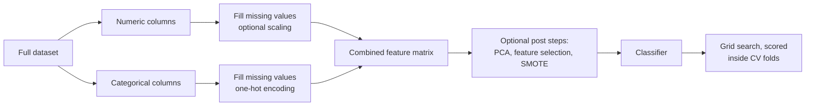

# Configurable ML Pipeline Framework & Dataset Diagnosis

This project has two components. The first is a configurable pipeline framework, built on scikit-learn and imbalanced-learn, for running controlled machine learning experiments: fifty-six in this case, covering four classifiers, seven preprocessing configurations, and two feature sets under identical conditions. The second is the investigation that followed from the results. Every experiment performed at chance level, and a systematic diagnosis concluded that the dataset itself, a publicly available heart attack risk dataset from Kaggle, contains no learnable relationship between its features and its target.

## Motivation

A comparison between models is only meaningful if every candidate is trained and evaluated under identical conditions. Writing fifty-six experiments by hand invites inconsistency; more importantly, it multiplies the opportunities for data leakage, which is among the most common methodological errors in applied machine learning.

Leakage occurs because preprocessing operations are themselves fitted to data. Scaling learns the mean and variance of the features it standardizes; class balancing learns the geometry of the minority class. If these operations are applied to the complete dataset before it is split into training and evaluation sets, information from the evaluation data influences the training process, and the resulting scores overstate the model's true performance.

> SMOTE, the class-balancing technique used in this project, is the clearest illustration. It compensates for an under-represented class by generating synthetic observations that interpolate between existing ones. Applied before the split, it places near-copies of evaluation observations directly into the training data.

The framework was designed so that the methodologically correct procedure is the default and only path while also providing high versatility in which pre- and post-processing steps to include. Every transformation is a step within the pipeline object itself, and is therefore re-fitted from scratch on the training portion of each cross-validation fold.

## The Pipeline Factory
 
The core of the framework is a factory function that assembles a complete pipeline from a model, a dataframe, and a list of processing steps. Numeric and categorical columns are detected by type and given base handling appropriate to each (imputation of missing values, one-hot encoding of categories). Each additional step is supplied as a tuple containing a destination tag, a step name, and the transformer itself. The tag selects one of three injection points: the numeric branch, the categorical branch, or the stage between preprocessing and the model. Declaring an experimental configuration reduces to listing its steps:
 
```python
scale_step = ('num', 'scaler', StandardScaler())
smote_step = ('post', 'smote', SMOTE(random_state=42))
 
run_models(
    "Scaling with SMOTE",
    df=df,
    target='Heart Attack Risk',
    models=models,            # four classifiers
    param_grids=param_grids,  # tuning ranges for each
    extra_steps=[scale_step, smote_step],
    test_size=0.25,
    metric=f1_for_class_1,
)
```
 
Order is preserved at each injection point, so composite strategies are expressed by sequence alone: scaling, then dimensionality reduction, then oversampling, with no change to the factory itself. A second function iterates a collection of models through a given configuration, tunes each by grid search, and records the results to a log file: confusion matrix, per-class metrics, best hyperparameters, and ROC AUC. Substituting a different preprocessing strategy is a one-line change, which is what makes a fifty-six experiment design practical.
 

 
*All steps to the left of the classifier are re-fitted on the training portion of each cross-validation fold, which preserves the integrity of the evaluation.*
 
The base preprocessing is a default rather than a fixed assumption. The assignment of columns to branches, the base steps each branch applies, and the treatment of columns that belong to neither branch are all exposed as optional parameters. An integer-coded categorical variable can be routed onto the categorical branch explicitly, the one-hot encoder can be exchanged for an ordinal one, and a branch's base preprocessing can be disabled entirely. The defaults reproduce the conventional treatment; the parameters exist so that the factory never has to be edited when a dataset departs from it.
 
### Scope and Limitations
 
The design goal was generality: any transformer conforming to the scikit-learn API can be injected at any of the three points without modifying the factory. In practice this covers most transformations one would want to apply, including scalers, encoders, imputers, dimensionality reduction, feature selection, and imbalanced-learn resamplers such as SMOTE. Two structural constraints remain, and both are properties of the architecture rather than oversights. Steps placed after preprocessing operate on the feature matrix only, so transformations of the target variable do not belong at that injection point. And because preprocessing consolidates the two branches into a single numeric array, original column names are not available downstream; steps at that stage must be indifferent to which column is which, a condition that PCA, feature selection, and resampling all satisfy. Within those bounds, the factory accepts and correctly cross-validates essentially any transformation strategy.

## Choice of Metric

The dataset is imbalanced: roughly 64% of patients are labelled low-risk and 36% at-risk. Accuracy is a degenerate measure under these conditions, since a classifier that predicts low-risk for every patient attains 64% accuracy while providing no information. The costs of the two error types are also asymmetric. A false positive results in unnecessary follow-up screening; a false negative assures an at-risk patient that they are healthy. Model selection was therefore based on the F1 score of the positive class, which balances precision and recall for at-risk patients, with particular weight given to recall.

## Results

No configuration achieved meaningful discrimination. Across all fifty-six experiments, spanning linear, probabilistic, and tree-based models, ROC AUC[^1] never exceeded 0.53, where 0.50 corresponds to random guessing. The one model that produced a respectable accuracy, Gaussian Naive Bayes at 64%, did so by predicting the negative class for every observation, reproducing the class balance rather than any learned structure.


*A representative result. The dashed diagonal corresponds to random guessing; the model's curve barely departs from it.*

A uniform null result of this kind admits two explanations: the models failed to find a signal that exists, or no signal exists to be found. The remainder of the project distinguishes between them.

## Dataset Diagnosis

The distinction can be tested without reference to any model. Classical significance tests were applied to every feature: chi-square tests of independence for the categorical variables and Welch t-tests for the numeric ones. No feature showed a statistically significant association with the target (all $p > 0.05$), and the correlation between each feature and the outcome was effectively zero.


*Correlation between each feature and the target variable. Every value lies close to zero.*

To rule out the possibility that a signal was present but poorly represented in the raw columns, three clinically motivated features were engineered: blood pressure parsed into its systolic and diastolic components and staged into ordered severity categories following clinical guidelines; mean arterial pressure derived from the raw readings; and a composite score counting co-occurring metabolic risk factors (diabetes, obesity, high triglycerides, elevated BMI). In a genuine patient population, these constructions are informative nearly by definition. Here they correlated with the outcome as weakly as the columns from which they were built, and repeating the full experimental sweep on the engineered feature set reproduced the chance-level results.

A final check used permutation importance, which measures the degradation in a model's predictions when a single feature is randomly shuffled. For the best-performing model, shuffling any feature produced no degradation whatsoever; the model had extracted information from none of them.

Taken together, the evidence supports a firm conclusion: the dataset was almost certainly generated synthetically, without any dependency between the patient attributes and the outcome. The strength of the conclusion comes from the agreement of several independent lines of evidence: model families with different assumptions, seven preprocessing strategies, engineered features, and statistical tests that involve no model at all.

## Remarks

Datasets that cannot support the question being asked of them arise regularly in practice, and the pressure to produce a model regardless is real. There are two common responses, and both are failures. The first is to continue adjusting until something appears to work, which typically succeeds only by introducing the leakage described above. The second is to deliver a chance-level model behind a superficially acceptable accuracy figure. Establishing that a dataset contains no signal, rigorously enough that the finding withstands scrutiny, takes longer than either and is considerably more valuable to whoever depends on the answer.

The full implementation, the analysis notebook, and the logs from every experiment are available in the [GitHub repository](https://github.com/mikeverwer/HeartAttackRiskPipeline); the README there documents the engineering details omitted here.

[^1]: ROC AUC (area under the receiver operating characteristic curve) can be read as the probability that the model ranks a randomly chosen positive case above a randomly chosen negative one. A value of 0.50 corresponds to random guessing; 1.00 corresponds to perfect discrimination.
