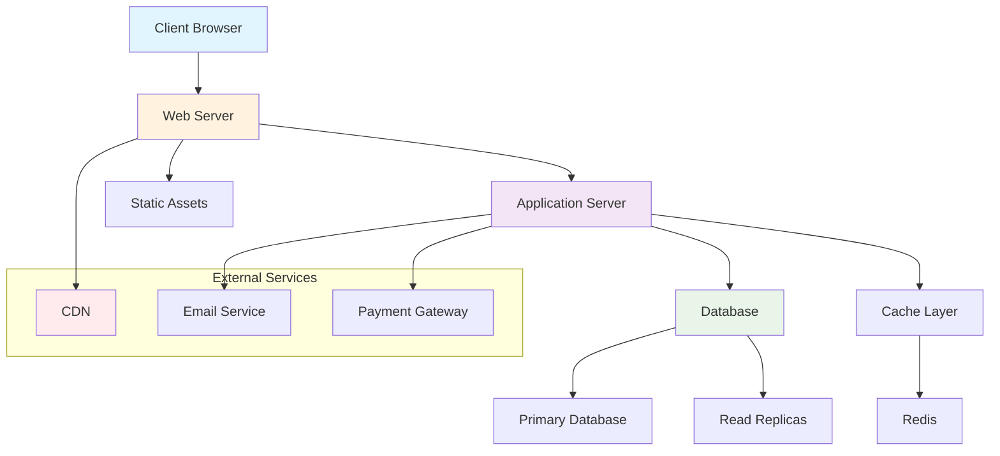

# Sample Markdown with Advanced Features

This document demonstrates description lists and footnotes in Markdown.

## Math Example

$\overline{\text{X}}\sim\mathcal{N}\left(\mu, \frac{\sigma}{\sqrt{N}}\right)$

## Mermaid Example

### System Architecture Diagram

## Unordered List and Ordered List example

- list item 1
- list item 2
  - sublist item 1
  - sublist item 2
- list item 3

1. first item
2. second item
   1. first subitem
   2. second subitem
3. third item

## Description List Example

Description lists (also called definition lists) allow you to create term-definition pairs:

Term 1
: Definition of the first term. This can span multiple lines and paragraphs.

: Additional definition for the same term.

Term 2
: This is the definition of the second term.

: Another definition for the second term.

Third term with longer name
: This is a much longer definition that might wrap across multiple lines in the output. Description lists are useful for glossaries, metadata displays, or any situation where you need to associate names with descriptions.

## Footnotes Demonstration

Here's a sentence that requires a citation[^1]. Footnotes are excellent for providing additional context or references without interrupting the main flow of your text.

You can also have multiple footnotes in the same document[^2]. Some markdown processors even support named footnotes[^named] that you can reference multiple times.

Here's another reference to the same footnote[^named] to demonstrate reuse.

## Combined Example

Mathematical Concept
: A branch of mathematics dealing with symbols and the rules for manipulating those symbols[^algebra].

: It includes everything from solving elementary equations to the study of abstractions such as groups, rings, and fields.

Algorithm
: A step-by-step procedure for calculations[^algorithm]. Algorithms are used for calculation, data processing, and automated reasoning.

: The concept is fundamental to computer science and mathematics.

## Code Example with Footnotes

Here's how you might document a function:

`calculateDistance()`
: Computes the Euclidean distance between two points in n-dimensional space[^euclid].

: Returns the distance as a floating-point number.

## References

[^1]: This is the first footnote reference. Typically used for citations from academic papers or detailed explanations.
[^2]: This is the second footnote. Footnotes appear at the bottom of the document or section.
[^named]: This is a named footnote that can be referenced multiple times. Useful for frequently cited sources.
[^algebra]: Source: "Abstract Algebra" by I.N. Herstein, 1986.
[^algorithm]: The word "algorithm" comes from the name of Persian mathematician al-Khwarizmi.
[^euclid]: Based on Euclidean geometry principles established around 300 BC.